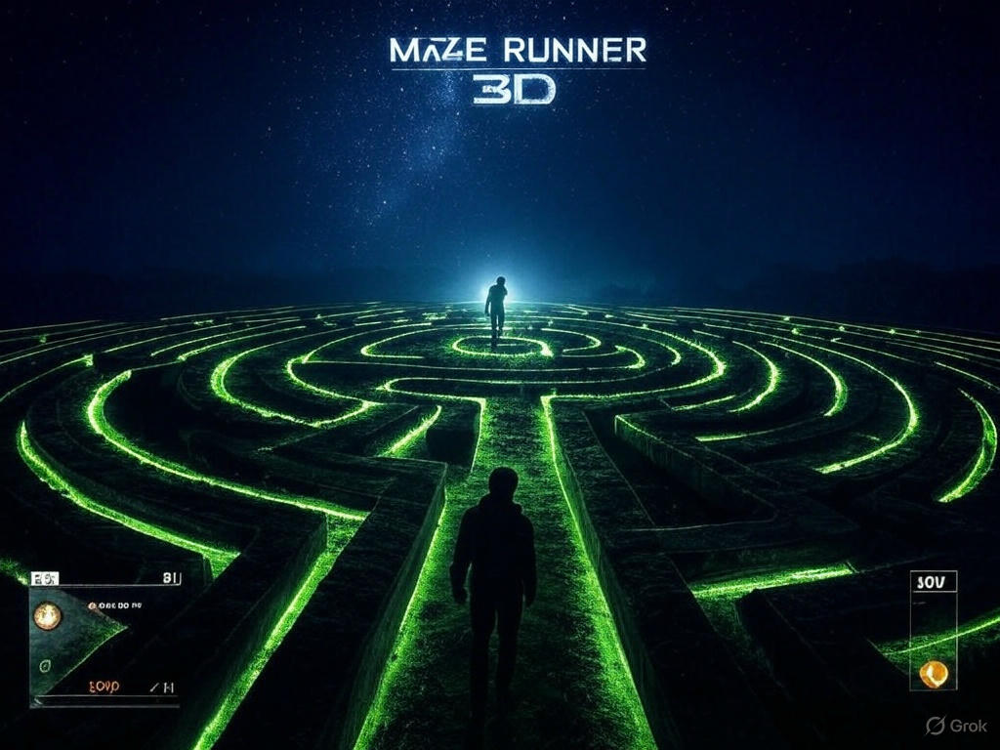
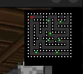

# 🏰 Maze Game (Raycasting 3D Maze)



## 📌 Overview

**Maze Game** is a **real-time 3D maze exploration game** built using **SDL2 and raycasting techniques**. The game renders a **pseudo-3D environment** using a **2D grid-based map**, creating an immersive experience for the player. Navigate through the maze, avoid obstacles, and uncover the secrets hidden within its walls!

<p align="center">
  
</p>

## 🎮 Features

- 🎯 **Raycasting rendering** for a **3D perspective**
- 🎮 **Player movement and rotation** using **WASD** and **Arrow Keys**
- 🏰 **Textured walls and floors** for a realistic feel
- 👹 **Dynamic enemy** to increase the challenge
- 🔫 **Weapon mechanics** for combat gameplay
- 🗺️ **Minimap feature** for navigation assistance
- 🛠️ **Modular code structure** for easy maintenance and expansion

<p align="center">
  
  
</p>

## 🛠️ Technologies Used

- **C Language** for core development
- **SDL2** for rendering and event handling
- **SDL2_image** for texture management
- **Raycasting Algorithm** for realistic 3D effects

## 📂 Project Structure

```
Maze
│-- inc/                     # Header files (Function prototypes & structures)
│   ├── maze.h               # Maze structure, constants, and functions
│   ├── player.h             # Player attributes, movement, and interaction functions
│   ├── weapon_sprites.h     # Weapon sprites and animations
│
│-- src/                     # Source files (Game logic & rendering)
│   ├── bullet.c             # Handles bullet movement, collision, and rendering
│   ├── enemy.c              # Enemy AI logic, movement, and attacks
│   ├── enemy2.c             # Additional enemy types with unique behavior
│   ├── main.c               # Entry point of the game (initialization & game loop)
│   ├── maze.c               # Maze generation, collision handling, and rendering
│   ├── minimap.c            # Renders the minimap with player and enemy positions
│   ├── player.c             # Handles player movement, actions, and updates
│   ├── raycast.c            # Raycasting engine for 3D rendering of the maze
│   ├── texture.c            # Loads and applies textures to walls, floors, and objects
│   ├── weapon.c             # Weapon mechanics (shooting, animations, damage handling)
│   ├── weapon_system.c      # Manages multiple weapons (ammo, switching, reloading)
│
│-- textures/                # Textures for the game world
│   ├── greystone.png        # Stone wall texture
│   ├── mossy.png            # Moss-covered wall texture
│   ├── wood.png             # Wooden wall texture
│   ├── enemies/             # Enemy sprite assets
│   │   ├── enm222.png       # Enemy variant sprite 1
│   │   ├── enm33.png        # Enemy variant sprite 2
│   ├── weapons/             # Weapon sprite assets
│       ├── gn111.png        # Gun sprite
│
│-- obj/                     # Compiled object files (generated during compilation)
│-- Makefile                 # Automates compilation and linking
│-- README.md                # Project documentation (setup, controls, and gameplay)
│-- screenshots/             # Screenshots and GIFs for documentation
```

## 🏗️ How the Raycasting Algorithm Works

Raycasting is used to create a **3D illusion from a 2D map** by casting rays from the player's viewpoint. Here's a breakdown of how it works:

1. **Cast Rays** 📡: For each vertical column of the screen, a ray is projected.
2. **Detect Wall Collisions** 🚧: The ray moves step by step until it hits a wall.
3. **Calculate Distance** 📏: The distance from the player to the wall is measured to determine depth.
4. **Render Wall Heights** 🏗️: The closer the wall, the taller it appears; the farther, the shorter.
5. **Apply Textures** 🎨: The correct slice of the texture is mapped to each wall column.

## 🚀 Installation & Running the Game

### **Prerequisites**

Ensure you have the following installed:

- **GCC Compiler**
- **SDL2 Development Libraries**
- **SDL2_image Library**

### **Install SDL2 & SDL2_image**

#### **Linux (Ubuntu/Debian)**

```sh
sudo apt update
sudo apt install libsdl2-dev libsdl2-image-dev
```

#### **MacOS (Homebrew)**

```sh
brew install sdl2 sdl2_image
```

### **Cloning the Repository**

To get started, clone the repository:

```sh
git clone https://github.com/M0imaritim/Maze.git
cd Maze
```

### **Compiling the Game**

Use the provided `Makefile` to compile the game:

```sh
make re
```

This generates the executable `maze_game`.

### **Running the Game**

After compilation, run:

```sh
./maze_game
```

## 🎮 Controls

| Key   | Action        |
| ----- | ------------- |
| W     | Move Forward  |
| S     | Move Backward |
| A     | Turn Left     |
| D     | Turn Right    |
| ← →   | Rotate View   |
| SPACE | Shoot Weapon  |
| ESC   | Quit Game     |

## 🛠️ Troubleshooting

### **Undefined Reference to `IMG_Load`, `IMG_Init`, `IMG_Quit`?**

Ensure you have linked SDL2_image correctly:

```sh
gcc -Wall -Werror -Wextra -pedantic -Iinc obj/*.o -o maze_game -lSDL2 -lSDL2_image -lm
```

### **Game Runs but No Window Appears?**

Check if SDL2 is installed correctly and that your system supports hardware acceleration.

## 🤝 Contributing

Feel free to fork the repository and submit pull requests! Contributions for **optimizations, bug fixes, and new features** are welcome.

## 📜 License

This project is licensed under the **MIT License**.

## ⚠️ Code Compliance

This code follows **strict compliance with the Betty coding style**.

---

### 🚀 Have Fun Exploring the Maze!
